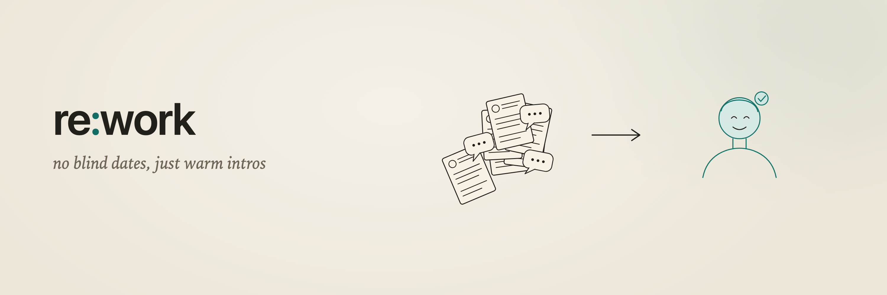

# Sift

### Spend more time talking to the right candidates.



Find the right candidates without reading the pile. Keep everyone else worth keeping.

Hiring buries you in inbound. Sift reads every applicant so you do not have to. It puts the few worth your time at the top in minutes instead of hours, and keeps the rest in one list you can actually stay on top of. The strong applicant who is not right for this role does not vanish into your inbox. They are the first name you pull up the next time you are hiring.

Made by [Re:Work](https://rwhq.io). If you would rather someone just ran your hiring, that is what Re:Work does. This is the same judgment, open and yours to run.

## What it does

- **Shortlist.** Sift reads the whole pile and puts the people worth your time at the top, each with one plain line on why. Minutes, not an afternoon.
- **Keep everyone.** Nobody good gets lost. Each applicant who is not right for this role is kept and tagged for what they might be right for: a different level, a role you open next quarter. Your inbound becomes a list that gets easier to stay on top of, not harder.
- **Reach out when you want.** When you are ready to talk to someone, Sift drafts the message in your voice and you send it. That part is optional, and it comes last, not first.

Built as an agent, so the real work lives in plain-language instructions you can read and change.

## Quickstart

```bash
npm install
npm run onboard          # sets up yours/: your role, your rubric, your preferences
# drop a CSV or JSON export of your inbound into yours/inbound/
npx eve dev              # talk to Sift, then type: run
```

Then open `/board` to see your shortlist, the maybes, and everyone you are keeping for later.

## Your layer

Everything personal lives in `yours/` (git-ignored), scaffolded from `yours.example/`:

- `yours/role.md`: the role and your rubric (what a yes, a maybe, and a keep-for-later look like)
- `yours/voice.md`: a couple of real messages you have sent, for when you want Sift to draft outreach in your voice
- `yours/preferences.json`: research on or off, which sources to read, and whether outreach drafts or sends
- `yours/inbound/`: drop your CSV or JSON exports here

Because you only ever edit `yours/`, you can pull updates to Sift without merge conflicts.

## Gmail (optional)

Sift can read applicants from a Gmail label, and, when you ask, write outreach as drafts you send yourself.

1. Create an OAuth client (Desktop) in Google Cloud and enable the Gmail API.
2. Scopes: `gmail.readonly` and `gmail.compose`.
3. Put `GOOGLE_CLIENT_ID`, `GOOGLE_CLIENT_SECRET`, and `GOOGLE_REFRESH_TOKEN` in `.env.local`.

Sending stays off until you turn it on. By default Sift makes a draft and you press send.

## Deploy

Run it locally with `npx eve dev`, the way a one-person desk runs. You can deploy to Vercel with `npx eve deploy`, but the board at `/board` and `/api/board` are unauthenticated and the data is yours, so gate any deployment behind Vercel Authentication before loading real applicants.

## License

MIT.
